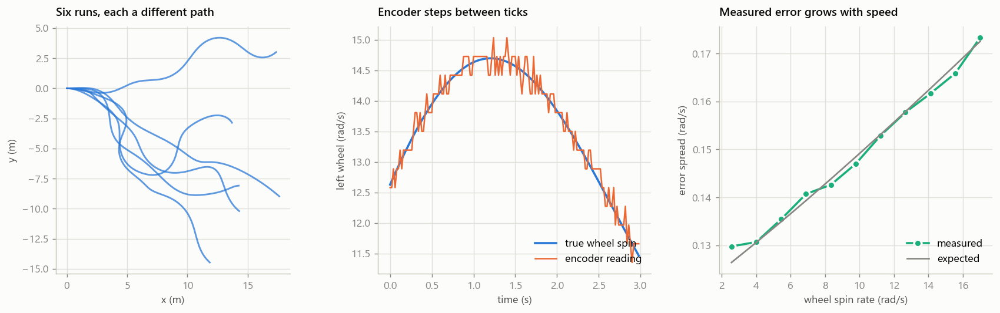

# ai4fly-estimation

Learned measurement models for joint state and sensor-health estimation on
unmanned aircraft, under onboard compute constraints.

In collaboration with Anthony (AJ) La Barca, Cooperative Human-Robot
Intelligence (COHRINT) Lab, Ann and H.J. Smead Department of Aerospace
Engineering Sciences, University of Colorado Boulder. The composite
state-and-health formulation below follows his proposal.

## Formulation

Estimation seeks `p(x | z)` for state `x` given measurements `z`. The
approach taken here defines the state as a composite vector holding not only
the vehicle states but the health of each sensor:

```
x = [ x_vehicle , x_sensor_1 , x_sensor_2 , ... , x_sensor_N ]
```

where each `x_sensor_i` is a continuous degradation level for that sensor
rather than a discrete healthy/faulty label. Estimating over this composite
state with a nonlinear filter yields both a distribution over vehicle states,
through ordinary sensor fusion, and a distribution over the health of each
sensor.

The continuous parameterisation is deliberate. A Gaussian filter propagates
means and covariances, so a discrete mode variable is not something it can
represent — estimating one requires a multiple-model or particle formulation,
a different architecture with different cost. A continuous health variable is
a quantity the filter can carry natively, and it admits partial degradation,
which is what most real faults look like before they become total. Detection
is consequently a regression problem throughout: the network predicts
continuous measurement values, and the filter estimates a continuous health
level. Nothing in the loop performs classification.

Dynamics propagation applies only to the vehicle states. Sensor-health
variables carry no explicit process model — they are static across the
prediction step and updated only when measurements arrive, which places the
burden of fault detection entirely on the measurement model. A persistence
term may be added to discourage rapid switching between healthy and faulty
under transient noise.

The measurement model is therefore the crux. It is conditioned on health
rather than on vehicle state alone,

```
z = h(x_vehicle, x_sensor_1, ..., x_sensor_N) + v
```

and must capture three things: how each measurement relates to the vehicle
states, how sensor health alters that relationship, and how health variables
relate to one another where one fault cascades into others.

A single learned function spans the range. At full health it reproduces the
standard state-to-measurement mapping; as health decreases it reproduces the
degraded characteristics typical of that fault — systematic bias, inflated
variance, or loss of correlation with the true state — with the intermediate
values interpolating between them. At inference, a sensor whose measurements
stop being consistent with the fused state drives its health estimate
downward, which both reduces that sensor's influence on the update and
improves the vehicle estimate by leaning more heavily on the sensors that
remain consistent. The adjustment is graded rather than a switch, so a
partially degraded sensor is partially trusted instead of being kept or
discarded outright.

Not every fault is uniquely isolable with a given sensor suite — a clogged
pitot tube resembles a change in wind absent a multi-hole probe to
disambiguate. Where observability fails, the filter's own consistency
statistics still carry information: a measurement that drives the innovation
covariance up is evidence for lowering the corresponding health estimate,
even where the responsible fault cannot be named.

## Relation to conservative fusion and adaptive filtering

Traditional fusion under possible faults, such as Covariance Intersection
[1], provides rigorous consistency guarantees by combining measurements
conservatively without assuming their cross-correlations are known. The cost
is inflated uncertainty and a less accurate state estimate. Conditioning the
measurement model on health trades that conservatism for adaptivity: faulty
measurements are downweighted rather than hedged against, and healthy ones
are used fully. Some formal guarantees are given up in exchange for accuracy,
which is likely to matter most where faults are transient or intermittent.

Identifying noise covariances online is itself long established, beginning
with Mehra [2], who derived consistency tests on the innovation sequence and
estimators for the process and measurement noise covariances from it. Such
methods are necessarily reactive: they infer covariance from realised
residuals, so several epochs of degraded behaviour must elapse before the
estimate responds, and a degraded sensor is not distinguished from a
misspecified model — both inflate residuals identically. Conditioning on
health acts earlier, on information available before a residual exists, at
the cost of requiring that the relevant fault mode was represented during
training.

## Learned measurement models

Learning the measurement map is an established response to model
misspecification. Ko and Fox [3] set out the general form, replacing the
parametric prediction and observation models of a Bayes filter with Gaussian
processes and instantiating the result as GP-UKF, GP-EKF, and GP-PF,
validated on a robotic blimp. Gupta and Guven [4] augment a Kalman filter
with a neural measurement model for UAV tracking in degraded sensing; de
Curtò and de Zarzà [5] combine a physics-informed network with an adaptive
UKF. All three show a learned map absorbing structure a hand-specified model
omits.

The Gaussian process case is worth separating out, because it supplies one
half of what is needed here and not the other. Its predictive variance grows
with distance from the training data, which is epistemic uncertainty obtained
for free and without a separate mechanism. But the noise term in a standard
GP is a single learned constant: homoscedastic by construction, and therefore
unable to express noise that varies with operating condition or with sensor
health. The approach here targets both components, at the cost of having to
construct the epistemic term rather than inheriting it.

### Why the map must predict a covariance, not only a mean

In the formulation above, health enters through `h`, which is the conditional
mean. The noise term `v` is drawn from a covariance that appears nowhere in
the learned function. A network trained to regress `z` can therefore
represent a fault that *shifts* a measurement, but not one that makes it
*noisier* — the mean is unchanged and the additional spread has nowhere to
reside. Since variance inflation is among the degradation modes the model is
required to capture, the covariance must itself be conditioned on health,
`R(x_health)`. A state-conditioned noise covariance is heteroscedastic
regression by construction; it is what completes the formulation rather than
an alternative to it.

Training such a model is not straightforward. Under the usual mean-variance
parameterisation the gradient on the mean is scaled by the inverse predicted
variance, so wherever variance is large the mean stops being fitted, and the
resulting residual justifies a larger variance still — a self-reinforcing
degenerate solution documented by Seitzer et al. [6]. Immer et al. [7] avoid
it by regressing the Gaussian natural parameters, under which the objective
is concave for a linear output layer, and pair this with a Laplace
approximation that keeps the weight posterior closed-form rather than
sampled.

### Distinguishing sensor degradation from model ignorance

That posterior separates predictive uncertainty into aleatoric and epistemic
parts: irreducible sensor noise against ignorance of the model itself. The
distinction addresses a limitation intrinsic to health estimation alone.

Residuals grow for two reasons — a sensor has degraded, or the model is wrong
about the present regime through unmodelled dynamics or conditions absent
from training. A filter estimating health has one explanatory variable
available, so it will attribute model error to sensor failure and report a
healthy sensor as degraded, precisely when the estimator is already under
strain. Epistemic uncertainty reads a different quantity — the input's
position relative to the training distribution rather than residual structure
— so high epistemic alongside large residuals indicates the model is
extrapolating, whereas low epistemic alongside large residuals indicates the
sensor.

The same signal bears on fault coverage. A health-conditioned map learns the
degradation modes present in its training data; a mode outside that set is
unrepresented, and the model still returns a health estimate with nothing to
indicate it is extrapolating. Ovadia et al. [8] show this is the expected
behaviour rather than a defect of any particular model: predictive
uncertainty degrades under distributional shift, and calibration holding
in-distribution fails under even mild shift.

Whether a full Bayesian posterior is warranted, or whether a simpler
distributional score in the manner of Hendrycks and Gimpel [9] suffices, is
open here and consequential for deployment, since the two differ by roughly
an order of magnitude in inference cost.

Reporting where a learned component's knowledge runs out is a narrow instance
of a broader capability: Israelsen et al. [12] treat competency
self-assessment as a first-class function of an autonomous system, rather
than as diagnostics attached after the fact.

### What this does not resolve

Where two faults are indistinguishable given the sensor suite, no
decomposition of uncertainty separates them; that is a property of the
hardware. Correlations between health variables — one fault cascading into
another — require training examples of joint faults, which are
combinatorially many. And the aleatoric component must still be learned from
data, so only the epistemic half is trainable on healthy operation alone.

## Evaluation

Filter consistency is the primary criterion, following Chen et al. [10], [11]:
normalised innovation and estimation-error squared statistics tested against
chi-square bounds. That work uses consistency as an objective for tuning a
fixed noise covariance; here it evaluates a learned, health-conditioned one.
The direction of failure is informative — innovations larger than predicted
indicate an unmodelled noise source, while innovations smaller than predicted
indicate a measurement that has stopped varying — and the two imply opposite
corrective actions.

Validation proceeds from controlled simulation, where all quantities are
observable and negative results are attributable, toward flight data and
ultimately hardware, with faults introduced deliberately in a controlled
setting.

## Known barriers

**Training data.** Supervised training requires runs pairing vehicle states
and sensor measurements with known health labels. Real in-flight faults are
rarely recorded cleanly enough to serve, so simulation carries most of the
burden — which makes the realism of the injected fault models a load-bearing
assumption rather than an implementation detail.

**Onboard compute.** The target platforms have limited onboard resources, so
inference must fit a real-time budget with a bounded worst-case execution
time. This excludes sampling-based posteriors, whose cost trades against
accuracy through a tunable parameter rather than a bound, and deep ensembles,
which scale in the ensemble size. A health-conditioned map is evaluated at
every sigma point — forward evaluations only, exportable to a lean runtime,
but scaling with the augmented state dimension. An epistemic term adds a
Jacobian: bounded, but requiring a runtime with automatic differentiation.
Both admit an execution bound; the constants differ and the comparison is
empirical.

## Contents

| Path | Description |
|---|---|
| `robot/dynamics.py` | Differential-drive kinematics: RK4 state propagation, wheel-speed relations, and the encoder inverse |
| `robot/trajectories.py` | Command profiles and rollout: a deterministic reference serpentine, and band-limited randomised episodes for Monte Carlo generation |
| `robot/sensors.py` | Healthy sensor models: quantised wheel encoders and a biased gyro, with state-dependent noise |
| `robot/train_baseline.py` | Point-prediction baseline: state to sensor readings, mean squared error, no uncertainty output |
| `data/robot_data.csv` | 100 runs of 20 s at 50 Hz (100,000 rows): state, true wheel rates, sensor readings, and the noise level that produced each reading |
| `data/robot_data_sample.csv` | The first two runs, for inspection without loading the full file |

Each row carries a `run` column. Splits must be made by run rather than by
row: the gyro bias is drawn once per run and shared by every sample in it, so
a row-level split leaks it across the divide.



A ground robot serves as the controlled setting: known kinematics, known
sensor geometry, and a redundant suite — three channels constraining two
quantities — so that health is observable and cross-channel disagreement is
meaningful.

```bash
python robot/dynamics.py        # property-based verification of the motion model
python robot/trajectories.py    # trajectory determinism and state-space coverage
python robot/sensors.py         # noise calibration, quantisation, channel redundancy
python robot/train_baseline.py  # point-prediction baseline
```

The baseline reaches the noise floor on held-out runs — 0.153 against a
limit of 0.149 for the encoders, 0.0123 against 0.0117 for the gyro — where
the limit combines sensor noise, encoder tick quantisation, and, for the
gyro, the per-run bias that is unknowable for a run not seen in training.
Its residual error tracks wheel speed, rising from 0.110 to 0.130 across the
range, while the model reports a single value throughout. That gap is what a
state-conditioned covariance is for.

## References

**Conservative fusion and adaptive filtering**

[1] S. J. Julier and J. K. Uhlmann, "A Non-divergent Estimation Algorithm in
the Presence of Unknown Correlations," *Proceedings of the American Control
Conference*, vol. 4, pp. 2369–2373, 1997.

[2] R. K. Mehra, "On the Identification of Variances and Adaptive Kalman
Filtering," *IEEE Transactions on Automatic Control*, vol. 15, no. 2,
pp. 175–184, 1970.
[doi:10.1109/TAC.1970.1099422](https://doi.org/10.1109/TAC.1970.1099422)

**Learned measurement models in filtering**

[3] J. Ko and D. Fox, "GP-BayesFilters: Bayesian Filtering Using Gaussian
Process Prediction and Observation Models," *Autonomous Robots*, vol. 27,
no. 1, pp. 75–90, 2009.
[doi:10.1007/s10514-009-9119-x](https://doi.org/10.1007/s10514-009-9119-x)

[4] A. Gupta and E. Guven, "Neural Aided Kalman Filtering for UAV State
Estimation in Degraded Sensing Environments," arXiv:2604.28107.

[5] J. de Curtò and I. de Zarzà, "Hybrid State Estimation: Integrating
Physics-Informed Neural Networks with Adaptive UKF for Dynamic Systems,"
*Electronics*, vol. 13, no. 11, 2208, 2024.
[doi:10.3390/electronics13112208](https://doi.org/10.3390/electronics13112208)

**Heteroscedastic regression and predictive uncertainty**

[6] M. Seitzer, A. Tavakoli, D. Antic, and G. Martius, "On the Pitfalls of
Heteroscedastic Uncertainty Estimation with Probabilistic Neural Networks,"
*International Conference on Learning Representations*, 2022.
[arXiv:2203.09168](https://arxiv.org/abs/2203.09168)

[7] A. Immer, E. Palumbo, A. Marx, and J. Vogt, "Effective Bayesian
Heteroscedastic Regression with Deep Neural Networks," *Advances in Neural
Information Processing Systems 36*, 2023.

[8] Y. Ovadia et al., "Can You Trust Your Model's Uncertainty? Evaluating
Predictive Uncertainty Under Dataset Shift," *Advances in Neural Information
Processing Systems 32*, 2019.

[9] D. Hendrycks and K. Gimpel, "A Baseline for Detecting Misclassified and
Out-of-Distribution Examples in Neural Networks," *International Conference
on Learning Representations*, 2017.
[arXiv:1610.02136](https://arxiv.org/abs/1610.02136)

**Filter consistency and self-assessment**

[10] Z. Chen, C. Heckman, S. Julier, and N. Ahmed, "Weak in the NEES?:
Auto-tuning Kalman Filters with Bayesian Optimization," 2018.
[arXiv:1807.08855](https://arxiv.org/abs/1807.08855)

[11] Z. Chen, H. Biggie, N. Ahmed, S. Julier, and C. Heckman, "Kalman Filter
Auto-Tuning With Consistent and Robust Bayesian Optimization," *IEEE
Transactions on Aerospace and Electronic Systems*, vol. 60, no. 2,
pp. 2236–2250, 2024.
[doi:10.1109/TAES.2024.3350587](https://doi.org/10.1109/taes.2024.3350587)

[12] B. W. Israelsen, N. R. Ahmed, M. Aitken, E. W. Frew, D. A. Lawrence, and
B. M. Argrow, "'A Good Bot Always Knows Its Limitations': Assessing Autonomous
System Decision-making Competencies through Factorized Machine
Self-confidence," 2024. [arXiv:2407.19631](https://arxiv.org/abs/2407.19631)

## Status

Research code under active development. Results are provisional and reported
with the conditions under which they were obtained.
